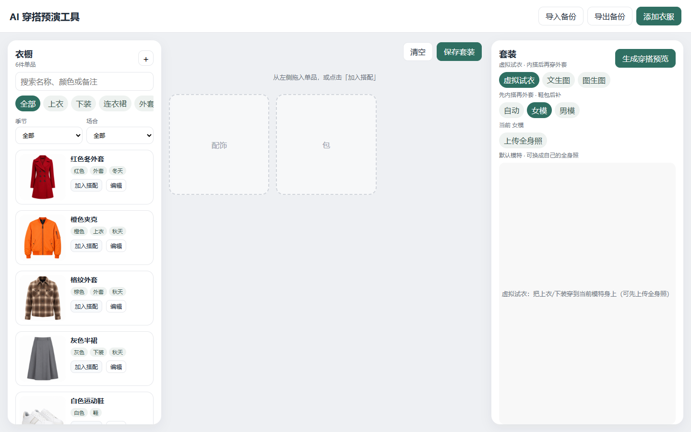
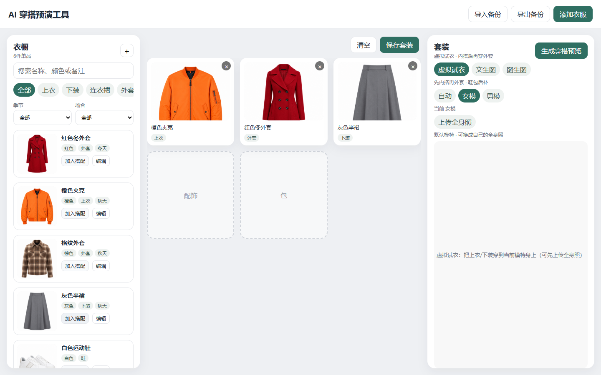
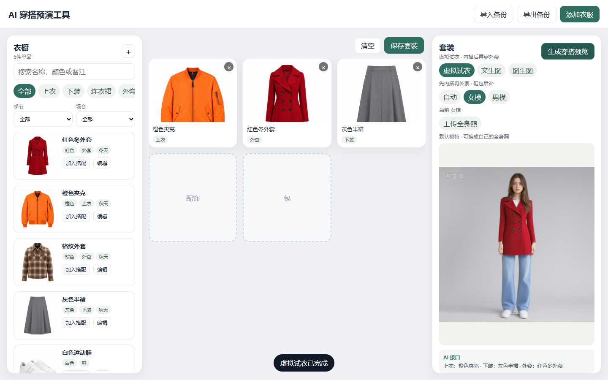

# 🧥 AI 穿搭预演工具

**Version 2.0**

把衣柜里的单品拖到搭配区，一键生成全身穿搭预览。v2.0 默认走 **虚拟试衣（阿里云百炼 AI试衣 Plus）**：先穿上衣/下装，有外套再穿一轮，鞋包在试衣成功后补上。失败或未配置时自动改用 **Qwen 图生图**；也可手选免费 **文生图（Kolors）**。没有 Key 时本地拼贴。

**AI Outfit Preview v2.0** — Virtual try-on first (inner layer, then coat), then shoes/bag. Qwen image-edit is the fallback; Kolors text-to-image is optional.

仓库：[github.com/huyibl/ai-outfit-preview](https://github.com/huyibl/ai-outfit-preview)

---

## 🎬 虚拟试衣演示

v2.0 录制片段：女模 → **虚拟试衣** → 橙色夹克 / 红色外套 / 灰色半裙 → 生成结果。

1. 选择虚拟试衣，可上传全身照  



2. 把上衣、外套、下装加入搭配  



3. 生成完成，右侧只显示试衣结果  



本地再录：`npm run demo:video`（会覆盖 `docs/` 里这组截图）。更早的文生图 + 图生图演示：[Bilibili BV1Kv8K6BE3F](https://www.bilibili.com/video/BV1Kv8K6BE3F/)

---

## ✨ 功能介绍

页面三栏：**衣橱 | 搭配 | 套装**。

### 衣橱

- 内置 6 件示例单品（红大衣、橙夹克、格纹外套、灰裙、白鞋、黑包），数据留在浏览器本地。
- 搜索、品类 / 季节 / 场合筛选。
- 一次导入多张衣服照片；文件名会尝试猜品类（例如文件名含「裙」→ 连衣裙）。
- 支持编辑名称、颜色、季节、场合；整库 JSON 备份导入导出。

### 搭配

- 从左栏拖到中栏，或点「添加」。
- 同品类互相替换（两件外套只留一件）。
- 连衣裙与上下装互斥。
- 「保存套装」把当前单品和预览图存到右栏历史。

### 套装预览

- 模特：自动 / 女模 / 男模，也可在右栏 **上传自己的全身照**（需头和脚都在画面里）。默认底图在 `public/models/female.png` 或 `male.png`。
- **虚拟试衣（默认）**：先穿上衣/下装，有外套时再穿一轮；鞋包在试衣成功后补一层。
- **文生图**：按单品文字描述生成全身写真（Kolors，免费额度）。
- **图生图**：Qwen 分层换装 + 姿态对齐，作为试衣兜底或手动选择。
- 右侧生成区 **只显示结果图**。
- 没有 Key 时退回本地 Canvas 拼贴。

### 出图策略

| 模式 | 做什么 | 何时使用 |
| --- | --- | --- |
| 虚拟试衣 | 百炼 `aitryon-plus`，内搭后再穿外套 | 默认，最接近真实试衣 |
| 图生图 | Qwen-Image-Edit 分层换装 | 试衣失败 / 未配百炼 Key / 手选 |
| 文生图 | Kolors 按文字生成 | 免费出一张完整穿搭照 |
| 本地合成 | Canvas 把单品贴到人台上 | 没网、没 Key、录作业 |

---

## 🚀 快速开始

需要 **Node.js 20+**（安装时勾选 Add to PATH）。

```bash
cd ai-outfit-preview
npm install
npm run dev
```

浏览器打开 http://localhost:5173 。不填密钥也能生成预览（本地合成）。

真实 AI 出图：复制 `.env.example` 为 `.env`。

- **虚拟试衣**：到 [阿里云百炼](https://bailian.console.aliyun.com/) 创建 **北京地域** Key，填入 `DASHSCOPE_API_KEY`。
- **文生图 / 图生图兜底**：到 [硅基流动](https://cloud.siliconflow.cn) 创建密钥，填入 `IMAGE_API_KEY`。图生图需要账户有余额。

Key 只给本机开发服务器读取，**不要提交 `.env`**。

**Quick start:** `npm install` then `npm run dev`. Set `DASHSCOPE_API_KEY` (Beijing) for try-on and `IMAGE_API_KEY` for Kolors / Qwen fallback.

---

## 🧩 技术栈

| 层 | 选型 | 说明 |
| --- | --- | --- |
| 运行 | Node.js 20+ | 一条 `npm` 命令即可 |
| 页面 | Vite 7、React 19、TypeScript 5.9 | 热更新快 |
| 拖拽 | 原生 HTML5 DnD | 依赖少 |
| 存储 | localStorage + IndexedDB | 图片不进 localStorage |
| 试衣 | 百炼 `aitryon-plus` + 临时 OSS 上传 | 默认路径：内搭 → 外套 |
| 图生图 / 文生图 | SiliconFlow Kolors / Qwen-Image-Edit | 兜底与免费出图 |
| 姿态 | MediaPipe Pose Landmarker Lite | 校验全身照、图生图对齐轮廓 |
| 录屏 | Playwright 1.55 | `npm run demo:video` |

不引入登录或数据库。没有 `/api/preview` 时自动只用本地合成。

### 性能与成本（本机实测口径）

| 路径 | 典型时延 | 费用 |
| --- | --- | --- |
| 本地 Canvas 合成 | 约 0.5–2 秒 | 免费 |
| 百炼 AI试衣 Plus | 约 15–40 秒/轮 | 按百炼计费 |
| Kolors 文生图 | 约 3–8 秒 | 免费额度 |
| Qwen 分层换装 | 约 8–20 秒/件 | 约 ¥0.30/件 |

精确单价以服务商控制台为准。

---

## 🔑 配置说明

| 参数 | 作用 | 默认 |
| --- | --- | --- |
| `DASHSCOPE_API_KEY` | 百炼虚拟试衣 | 空则改用 Qwen 或本地合成 |
| `DASHSCOPE_BASE` | 百炼接口（北京） | `https://dashscope.aliyuncs.com` |
| `DASHSCOPE_TRYON_MODEL` | 试衣模型 | `aitryon-plus` |
| `IMAGE_API_KEY` | 硅基流动令牌 | 空 |
| `IMAGE_API_BASE` | 图像接口根路径 | `https://api.siliconflow.cn/v1` |
| `IMAGE_TXT_MODEL` | 文生图 | `Kwai-Kolors/Kolors` |
| `IMAGE_EDIT_MODEL` | 图生图兜底 | `Qwen/Qwen-Image-Edit-2509` |

---

## 🤝 贡献与许可证

欢迎 Issue / PR。请保持「无 Key 也能跑通演示」：新功能不要把真实 API 做成硬依赖。提交前执行 `npm run build`。

许可证：[MIT](LICENSE)。
